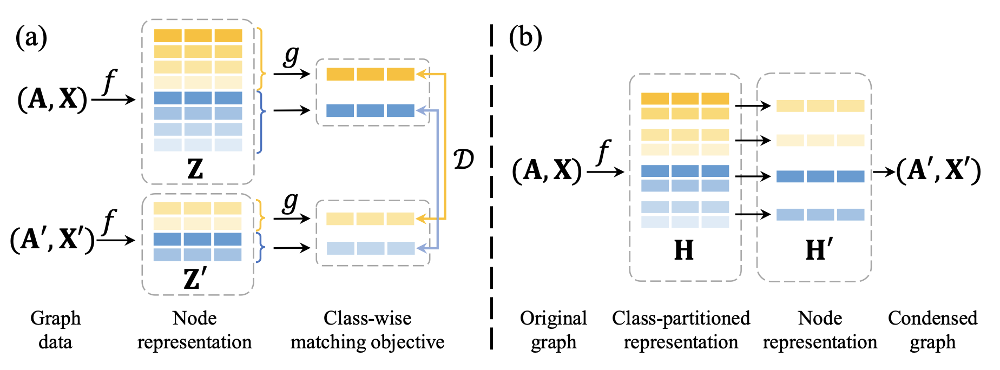

# Class-partitioned Graph Condensation (CGC)

## Introduction
This repository is the implementation of WWW 2025 paper: Rethinking and Accelerating Graph Condensation: A Training-Free Approach with Class Partition. 

CGC improves the class-to-class matching paradigm of existing graph condensation methods to the novel **class-to-node matching paradigm**, therefore achieving an exceedingly efficient condensation process with advanced accuracy.

<p align="center">

</p>

For more works about graph condensation, please refer to our survey paper 🔥[Graph Condensation: A Survey](https://arxiv.org/abs/2401.11720v2) and paper list [Graph Condensation Papers](https://github.com/XYGaoG/Graph-Condensation-Papers).


## Requirements
All experiments are implemented in Python 3.9 with Pytorch 1.12.1.

To install requirements:
```setup
pip install -r requirements.txt
```

## Datasets
* For Cora and Citeseer, they will be downloaded from [PyG](https://www.pyg.org/).
* Ogbn-products will be downloaded from [OGB](https://ogb.stanford.edu/docs/nodeprop/).
* For Ogbn-arxiv, Flickr and Reddit, we use the datasets provided by [GraphSAINT](https://github.com/GraphSAINT/GraphSAINT). They are available on [Google Drive link](https://drive.google.com/open?id=1zycmmDES39zVlbVCYs88JTJ1Wm5FbfLz) (alternatively, [BaiduYun link (code: f1ao)](https://pan.baidu.com/s/1SOb0SiSAXavwAcNqkttwcg)). Rename the folder to `./dataset/` at the root directory. Note that the links are provided by GraphSAINT team. 


## Condensation and Model Training

To condense the graph using CGC and train GCN models:

```bash
$ python main.py --gpu 0 --dataset reddit --ratio 0.001 --generate_adj 1
```

For more efficient graphless variant CGC-X: 
```bash
$ python main.py --gpu 0 --dataset reddit --ratio 0.001 --generate_adj 0
```

All scripts of different condensation ratios are provided in `run.sh`. 

Results will be saved in `./results/`.


## Aknowledgements
We express our gratitude for the contributions of [GGond](https://github.com/ChandlerBang/GCond/tree/main) and [FAISS](https://github.com/facebookresearch/faiss) in their remarkable work.


## Citation

```
@inproceedings{gao2025rethinking,
 title={Rethinking and Accelerating Graph Condensation: A Training-Free Approach with Class Partition},
 author={Gao, Xinyi and Ye, Guanhua and Chen, Tong and Zhang, Wentao and Yu, Junliang and Yin, Hongzhi},
 booktitle={Proceedings of the ACM on Web Conference 2025},
 year={2025}
}
```
